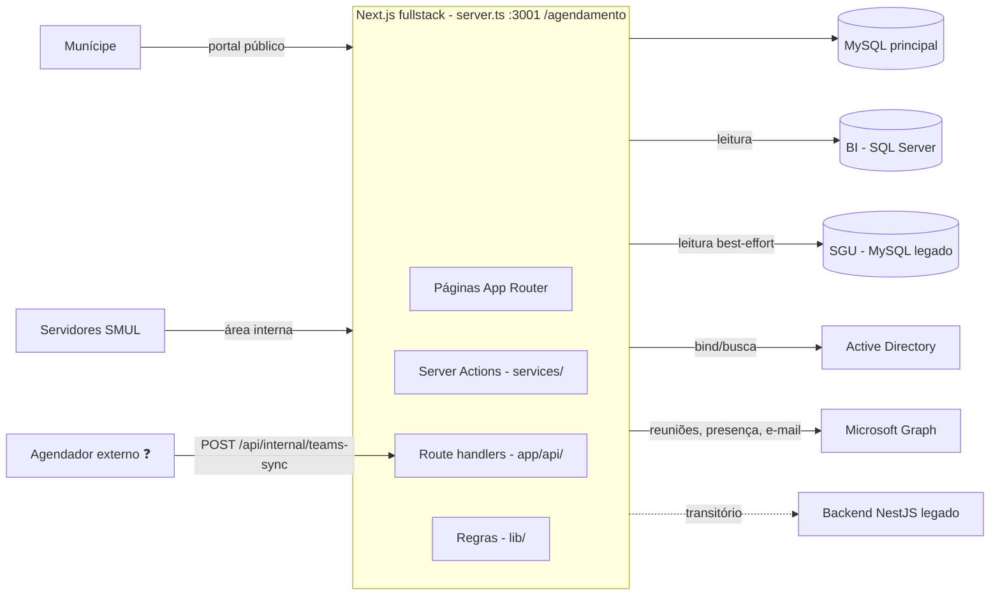

# 1. Visão geral e arquitetura

## Objetivo

Gerenciar atendimentos técnicos da SMUL relacionados a processos de licenciamento:

- **Munícipes** solicitam atendimento pelo portal público, a partir do número do processo (validado na base BI) ou abrindo um pedido de orientação sobre pré-projeto (Sala Arthur Saboya).
- **Servidores** (técnicos, pontos focais, coordenadores, diretores, CAP, portaria e administradores) triam, atribuem, confirmam, realizam e registram o resultado dos atendimentos.
- Atendimentos online geram reuniões **Microsoft Teams** automaticamente, e a presença é lida do relatório do Teams para definir se o atendimento foi realizado.

Requisitos de negócio de origem: [historico/](historico/README.md) (`REQUISITOS_PORTAL_AGENDAMENTOS.md`).

## Stack ✅

| Camada | Tecnologia | Evidência |
|---|---|---|
| Framework | Next.js 16 (App Router, Server Actions), React 19, TypeScript | [package.json](../../package.json) |
| Servidor HTTP | Custom server Node (`http` + Next + Socket.IO) executado com `tsx` | [server.ts](../../server.ts) |
| UI | Tailwind CSS 4, shadcn/ui (Radix), lucide-react, sonner, recharts | [components.json](../../components.json) |
| Estado/dados no cliente | TanStack Query, TanStack Table, react-hook-form + zod | [providers/QueryProvider.tsx](../../providers/QueryProvider.tsx) |
| Autenticação (servidores) | NextAuth v5 (Credentials, sessão JWT), jose, bcryptjs, LDAP (ldapts) | [lib/auth/auth.config.ts](../../lib/auth/auth.config.ts), [lib/auth-core.ts](../../lib/auth-core.ts) |
| Autenticação (munícipes) | JWT próprio (jose) + bcrypt | [lib/municipes-auth-core.ts](../../lib/municipes-auth-core.ts) |
| ORM / banco | Prisma 5 + MySQL 8.4 | [prisma/schema.prisma](../../prisma/schema.prisma) |
| Bancos externos | SGU (MySQL, leitura), BI (SQL Server via `mssql`, leitura) | [lib/prisma-sgu.ts](../../lib/prisma-sgu.ts), [lib/bi-processos.ts](../../lib/bi-processos.ts) |
| Integração Microsoft | Microsoft Graph (client credentials) | [lib/teams-graph.ts](../../lib/teams-graph.ts) |
| Planilhas | `xlsx` | [lib/agendamentos-import.ts](../../lib/agendamentos-import.ts) |

## Diagrama de contexto

## Estilo arquitetural ✅

- **Monólito fullstack**: páginas, Server Actions e route handlers no mesmo processo Next.js.
- **Camadas por convenção** (ver [02-estrutura-de-pastas.md](02-estrutura-de-pastas.md)):
  - `app/` — páginas e componentes de tela;
  - `services/<dominio>/query-functions` — leituras (Server Actions `'use server'`);
  - `services/<dominio>/server-functions` — escritas (Server Actions);
  - `lib/*-core.ts` e demais — regras de negócio e integrações (`server-only`).
- **Resposta padrão das Server Actions**: `{ ok, error, data, status }` (ex.: [services/agendamentos/server-functions/criar.ts](../../services/agendamentos/server-functions/criar.ts)).
- **Autorização em cada ação** via [lib/authz.ts](../../lib/authz.ts) — não há `middleware`/`proxy`.
- **Cache**: invalidação por `revalidateTag('agendamentos' | 'users' | ...)`.
- **Auditoria**: tabela `eventos_agendamento` registra criação, mudanças de status, reatribuições, encaminhamentos e conflitos.
- **Concorrência**: `SELECT ... FOR UPDATE` em técnicos e agendamentos, e `updateMany` condicionado ao status anterior (bloqueio otimista).

## Origem e transição

O código foi migrado incrementalmente de um backend NestJS para dentro do Next.js (comentários "Porta de ..." em [lib/authz.ts](../../lib/authz.ts) e [lib/auth-core.ts](../../lib/auth-core.ts)). **O NestJS será descontinuado na versão fullstack.** As partes que ainda dependem dele estão listadas em [12-migracao-nestjs.md](12-migracao-nestjs.md).

## Decisões relevantes

- [ADR 0001 — Horário civil de São Paulo em campos UTC](adr/0001-horario-civil-sp-em-campos-utc.md)
- [ADR 0002 — Custom server com Socket.IO](adr/0002-custom-server-socketio.md)
