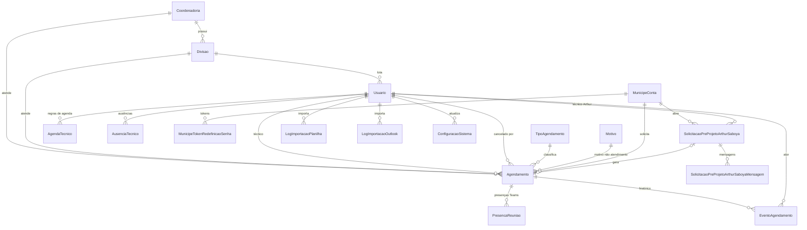

# 6. Banco de dados

## Bancos utilizados

| Banco | Tecnologia | Acesso | Uso |
|---|---|---|---|
| Principal | MySQL 8.4 | Leitura e escrita (Prisma) | Todo o domínio do sistema |
| SGU (legado) | MySQL | Leitura, best-effort (`$queryRaw`) | Descobrir a unidade/divisão de um servidor pelo login de rede |
| BI | SQL Server | Leitura (`mssql`) | Situação de comunique-se e despachos de processos |

## Modelo principal

Fonte: [prisma/schema.prisma](../../prisma/schema.prisma). Todas as chaves primárias são UUID (`String @default(uuid())`), exceto `configuracoes_sistema` (chave textual).

## Tabelas

| Modelo (tabela) | Finalidade | Observações |
|---|---|---|
| `Usuario` (`usuarios`) | Servidores | `login` e `email` únicos; `senha` só para login local (bcrypt); `permissao` (padrão `PORTARIA`); `divisaoId` define o escopo |
| `Coordenadoria` (`coordenadorias`) | Unidades de 1º nível | `sigla` única; `email` usado como fallback em avisos e convites |
| `Divisao` (`divisoes`) | Unidades de 2º nível | `sigla` única; pertence a uma coordenadoria |
| `Agendamento` (`agendamentos`) | Atendimento | Ver grupos de campos abaixo |
| `AgendaTecnico` (`agendas_tecnicos`) | Regra recorrente de disponibilidade | `diaSemana` 0–6, `horaInicio`/`horaFim` `HH:mm`, `duracaoMinutos`, `modalidade`, vigência, `ativo` |
| `AusenciaTecnico` (`ausencias_tecnicos`) | Ausências (férias, licença etc.) | `tipo` livre (até 80 caracteres), intervalo, `ativo` |
| `EventoAgendamento` (`eventos_agendamento`) | Auditoria | `tipo` + `dados` JSON. Exclusão do agendamento é bloqueada (`Restrict`) |
| `TipoAgendamento` (`tipos_agendamento`) | Tipos | `texto` único; criado automaticamente na importação e no portal |
| `Motivo` (`motivos`) | Motivos de não atendimento | `texto` único |
| `PresencaReuniao` (`presencas_reuniao`) | Participantes do relatório do Teams | Excluída junto com o agendamento |
| `ConfiguracaoSistema` (`configuracoes_sistema`) | Chave/valor | Hoje: `TEAMS_ORGANIZER_EMAIL` |
| `MunicipeConta` (`municipes_contas`) | Conta do munícipe | `email` único, `senha_hash` bcrypt |
| `MunicipeTokenRedefinicaoSenha` | Tokens de redefinição | Guarda só o hash SHA-256; expira em 60 min; uso único |
| `SolicitacaoPreProjetoArthurSaboya` | Pedido de orientação | `protocolo` único; status próprio; avaliação; vínculo 1:1 opcional com `Agendamento` |
| `SolicitacaoPreProjetoArthurSaboyaMensagem` | Chat do pedido | Autor `MUNICIPE`, `PONTO_FOCAL` ou `SISTEMA` |
| `LogImportacaoPlanilha`, `LogImportacaoOutlook` | Registro de importações | Total importado e usuário |

### Grupos de campos de `Agendamento`

| Grupo | Campos |
|---|---|
| Identificação | `municipe`, `cpf`, `email`, `telefone`, `processo`, `resumo`, `relacaoInteressado` |
| Agenda | `dataHora`, `dataFim`, `status`, `modalidade`, `localAtendimento`, `sala`, `orientacaoAcesso` |
| Responsáveis | `coordenadoriaId`, `divisaoId`, `tecnicoId`, `tecnicoRF`, `tecnicoResponsavelPlanilha` |
| Origem | `importado`, `importadoOutlook`, `origemPortalProcesso`, `municipeContaId`, `origemAgendamento`, `tipoAgendamentoId` |
| CAP | `conferenciaCapStatus`, `observacaoCap`, `confirmadoProcessoAusente` |
| Snapshot do BI | `unidadeDespachoBi`, `encontradoNoBi`, `biComuniqueSe`, `biIndeferido`, `tipoRecurso`, `ocorrenciaBiId`, `protocoloOrigem`, `sistemaOrigem`, `situacaoRecurso`, `unidadeOrigem`, `responsavelOriginal`, `responsavelOriginalRF`, `snapshotBiEm`, `duvidaAtendimento` |
| Técnico reserva | `encaminhadoReservaEm`, `motivoEncaminhamentoReserva` |
| Cancelamento | `motivoCancelamento`, `canceladoEm`, `canceladoPorId`, `motivoNaoAtendimentoId` |
| Teams | `teamsEventId`, `teamsJoinUrl`, `teamsMeetingId`, `teamsOrganizerEmail`, `teamsUltimoErro`, `teamsSyncPendente`, `teamsSyncVersao`, `teamsSyncTentativas`, `teamsSyncEmProcessamentoAte`, `presencaSincronizadaEm` |

## Enums

| Enum | Valores |
|---|---|
| `Permissao` | DEV, ADM, TEC, ARTHUR_SABOYA, ADM_ARTHUR_SABOYA, USR, PONTO_FOCAL, COORDENADOR, PORTARIA, DIRETOR |
| `StatusAgendamento` | SOLICITADO, AGENDADO, CANCELADO, CONCLUIDO, ATENDIDO, NAO_REALIZADO |
| `ModalidadeAgendamento` | PRESENCIAL, ONLINE |
| `OrigemAgendamento` | RECURSO, ARTHUR_SABOYA |
| `TipoRecursoAtendimento` | DESPACHO, COMUNIQUE_SE |
| `RelacaoInteressado` | AUTOR_PROJETO, AUTORIZADO, PROPRIETARIO, RESPONSAVEL_TECNICO, TERCEIROS |
| `ConferenciaCapStatus` | AGUARDANDO, ENCAMINHADO, NAO_ENCONTRADO |
| `StatusSolicitacaoPreProjeto` | SOLICITADO, RESPONDIDO (exibido como "Solucionado"), AGUARDANDO_DATA, AGENDAMENTO_CRIADO |
| `AutorMensagemPreProjetoArthurSaboya` | MUNICIPE, PONTO_FOCAL, SISTEMA |

## Tipos de evento registrados em `eventos_agendamento`

| Tipo | Gerado em |
|---|---|
| `CRIADO` | Criação interna ou pelo portal (`dados.origem` = `INTERNO`/`PORTAL`) |
| `STATUS_ALTERADO` | Atualização manual ou pela sincronização de presença (`origem: TEAMS`) |
| `CANCELADO` | Cancelamento pela administração, portal, CAP ou Teams |
| `REATRIBUIDO_OU_REMARCADO`, `ATRIBUIDO_RESERVA` | Troca de técnico ou horário |
| `ENCAMINHADO_RESERVA` | Criação pelo portal com o técnico original ausente |
| `ENCAMINHADO_CAP` | Encaminhamento pela CAP |
| `CONFLITO_AUSENCIA` | Ausência cadastrada sobre um agendamento confirmado |

## Índices relevantes

`agendamentos`: `conferenciaCapStatus`, `municipeContaId`, `origemPortalProcesso`, `ocorrenciaBiId`, `(teamsSyncPendente, teamsSyncEmProcessamentoAte)`. `agendas_tecnicos`: `(tecnicoId, diaSemana, ativo)`. `ausencias_tecnicos`: `(tecnicoId, dataHoraInicio, dataHoraFim)`.

## Datas e horários

Os campos `DateTime` guardam o **horário civil de São Paulo como se fosse UTC**. Ver [ADR 0001](adr/0001-horario-civil-sp-em-campos-utc.md).

## Migrações

Conteúdo conferido nos arquivos `migration.sql` de [prisma/migrations](../../prisma/migrations/):

| Migração | Conteúdo |
|---|---|
| `0_init` | Cria `usuarios`, `agendamentos`, `tipos_agendamento`, `motivos`, `coordenadorias`, `divisoes`, `solicitacoes_pre_projeto_arthur_saboya`, `solicitacoes_pre_projeto_arthur_saboya_mensagens`, `log_importacao_planilha`, `log_importacao_outlook`, `municipes_contas`, `municipes_tokens_redefinicao_senha` |
| `20260706120000_add_permissao_adm_arthur_saboya` | Inclui `ADM_ARTHUR_SABOYA` no enum `permissao` de `usuarios` |
| `20260825180000_teams_reunioes` | Cria `configuracoes_sistema` e `presencas_reuniao`; adiciona a `agendamentos` os campos `teams*` (evento, link, meeting, organizador, último erro), de cancelamento e `presencaSincronizadaEm` |
| `20260902160000_portal_processos` | Adiciona a `agendamentos`: telefone, relação com o projeto, origem portal, status da CAP, dados do BI, `confirmadoProcessoAusente`, `observacaoCap`, `municipeContaId` |
| `20260928120000_contexto_recurso_modalidade` | Adiciona a `agendamentos`: modalidade, origem, snapshot do recurso no BI, dúvida, `localAtendimento`, `sala`, `orientacaoAcesso` |
| `20260928140000_agenda_ausencias_tecnicos` | Cria `agendas_tecnicos` e `ausencias_tecnicos` |
| `20260928160000_encaminhamento_reserva` | Adiciona `encaminhadoReservaEm` e `motivoEncaminhamentoReserva`; cria `eventos_agendamento` |
| `20260928180000_sincronizacao_teams` | Adiciona a `agendamentos` os campos da fila `teamsSync*` |

## Bancos externos

### SGU

- Client: [lib/prisma-sgu.ts](../../lib/prisma-sgu.ts) — client Prisma principal apontado para `SGU_DATABASE_URL`, usando só SQL bruto.
- Consulta: `tblUsuarios` × `tblUnidades` por `cpUsuarioRede` → `sigla` da unidade, comparada com a `sigla` das divisões locais ([lib/usuarios-core.ts](../../lib/usuarios-core.ts)).
- Falhas são ignoradas (retorna `null`).
- O schema [prisma/sgu/schema.prisma](../../prisma/sgu/schema.prisma) gera um client tipado que não é usado nas consultas.

### BI

- Client: [lib/bi-processos.ts](../../lib/bi-processos.ts) (pool `mssql` reaproveitado entre requisições).
- `dbo.prata_comuniquese`: `processo`, `protocolo`, `sistema`, `situacaoComuniquese`, `unidadeComuniquese`, `responsavelComuniquese`, `responsavelComuniqueseID`.
- `dbo.prata_despacho`: `processo`, `protocolo`, `sistema`, `situacaoDespacho`, `unidadeDespacho`, `responsavelDespacho`, `responsavelDespachoID`.
- Busca por igualdade em `processo` **ou** `protocolo`.
- O BI não fornece chave de ocorrência: o sistema gera um ID por SHA-256 dos campos ([lib/bi-processos.ts](../../lib/bi-processos.ts)).
