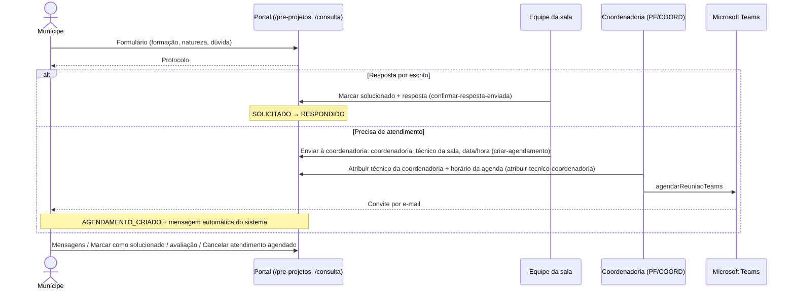

# Sala Arthur Saboya — pré-projetos

Atendimento de orientação técnica sobre pré-projetos (consultas prévias). O munícipe abre um **chamado**, com troca de mensagens, que pode virar um atendimento online.

> **Situação da implementação**: a maior parte das operações deste fluxo ainda é atendida pelo backend NestJS legado, que será descontinuado ([12-migracao-nestjs.md](../12-migracao-nestjs.md)). As telas e as regras descritas abaixo foram confirmadas neste repositório. O que acontece dentro das rotas do NestJS está **Pendente de confirmação**.

## Modelo de dados

- `SolicitacaoPreProjetoArthurSaboya` ([prisma/schema.prisma](../../../prisma/schema.prisma)): protocolo único, nome, e-mail, formação, natureza da dúvida, dúvida, status, avaliação (nota, comentário, data), data do agendamento, coordenadoria, divisão, conta do munícipe, técnico Arthur Saboya e vínculo 1:1 com `Agendamento`. Protocolos com prefixo `PP-` ou `AS-` também são ligados pelo campo `processo` do agendamento ([atualizar.ts](../../../services/agendamentos/server-functions/atualizar.ts)).
- `SolicitacaoPreProjetoArthurSaboyaMensagem`: mensagens do chamado; autor `MUNICIPE`, `PONTO_FOCAL` ou `SISTEMA`.
- Tipo de agendamento fixo: **"Pré-projetos (Arthur Saboya)"** (`TIPO_AGENDAMENTO_ARTHUR_SABOYA` em [lib/reuniao-teams-titulos.ts](../../../lib/reuniao-teams-titulos.ts)).

## Status da solicitação

| Status | Significado (exibido como) |
|---|---|
| `SOLICITADO` | Aberta |
| `RESPONDIDO` | Solucionado |
| `AGUARDANDO_DATA` | Enviada à coordenadoria, aguardando técnico e horário |
| `AGENDAMENTO_CRIADO` | Atendimento agendado |

Pendente de confirmação: as funções `podeConcluirChamadoArthurSaboya`, `statusPermiteConclusaoChamadoArthurSaboya` e `rotuloBotaoConclusaoChamadoArthurSaboya` ([lib/arthur-saboya-perfis.ts](../../../lib/arthur-saboya-perfis.ts)) definem rótulos de encerramento ("Marcar solucionado", "Encerrar chamado", "Concluir atendimento"), mas **não são usadas** por nenhuma tela.

## Perfis

- `ARTHUR_SABOYA` (técnico) e `ADM_ARTHUR_SABOYA` (administrador local). Ao receber um desses perfis, o usuário é lotado automaticamente na **divisão Arthur Saboya**:
  - `DIVISAO_ID_PRE_PROJETOS`;
  - ou, se não houver, uma divisão ativa da CAP com sigla `ARTHUR_SABOYA` ou `ATHURSABOYA`, ou com nome contendo "Arthur Saboya" ([lib/usuarios-core.ts](../../../lib/usuarios-core.ts)).
- Técnicos `TEC` lotados nessa divisão veem também os agendamentos da divisão ([lib/agendamentos-core.ts](../../../lib/agendamentos-core.ts)).

### Papéis na tela do chamado

Fonte: [chamado-pre-projeto-portal-view.tsx](../../../app/(rotas-auth)/pedidos-pre-projetos-arthur-saboya/_components/chamado-pre-projeto-portal-view.tsx).

| Papel | Quem | Ações |
|---|---|---|
| Equipe da sala (`usuarioArthur`) | `ARTHUR_SABOYA`; `TEC` ou `PONTO_FOCAL` lotados na divisão da sala (`NEXT_PUBLIC_DIVISAO_ID_PRE_PROJETOS`); DEV; ADM | "Marcar solucionado" (só em `SOLICITADO`); "Enviar à coordenadoria" / "Trocar técnico da Sala Arthur" (em `SOLICITADO`, `AGUARDANDO_DATA` ou `AGENDAMENTO_CRIADO`) |
| Coordenadoria (`usuarioPodeAtribuirCoordenadoria`) | `COORDENADOR`; `PONTO_FOCAL` de fora da sala; ADM; DEV | "Atribuir técnico da coordenadoria" (em `AGUARDANDO_DATA` ou `AGENDAMENTO_CRIADO`) |

Pendente de confirmação: `ADM_ARTHUR_SABOYA` não se enquadra em nenhum dos dois papéis nesta tela. O código também compara com o valor `TEC_AS`, que não existe no enum `Permissao`.

## Fluxo

## Regras confirmadas neste repositório

- **Fora da lista geral**: os agendamentos desse tipo não aparecem na lista geral nem no dashboard (`whereExcluirPreProjetoArthurNaListaAgendamentos` em [lib/agendamentos-core.ts](../../../lib/agendamentos-core.ts)) e são recusados pela Server Action `criar` ([criar.ts](../../../services/agendamentos/server-functions/criar.ts)).
- **Duração**: 30 min (`PRE_PROJETO_DURACAO_ATENDIMENTO_MINUTOS`).
- **Horários**: "Enviar à coordenadoria" só aceita minutos 00 ou 30. "Atribuir técnico da coordenadoria" usa os horários livres da agenda do técnico (`consultarDisponibilidadeTecnico`).
- **Marcar solucionado**: exige resposta com pelo menos 2 caracteres.
- **Reunião**: atribuir técnico (`atualizar`) **não cria** a reunião automaticamente neste fluxo. A tela chama `agendarReuniaoTeams` logo depois da atribuição ([atualizar.ts](../../../services/agendamentos/server-functions/atualizar.ts)). Antes, confere se há e-mail do munícipe e do técnico da sala.
- **Falha na reunião**: a tela oferece o compose do Outlook ([lib/outlook-agendamento-teams.ts](../../../lib/outlook-agendamento-teams.ts)) e, se o usuário confirmar, chama `atualizar` com `status: AGENDADO`.
- **Mensagem ao munícipe**: ao passar o agendamento para `AGENDADO`, ou ao criar a reunião, a solicitação vai para `AGENDAMENTO_CRIADO` e recebe esta mensagem do sistema: "O atendimento técnico foi agendado para o dia {data} às {hora}. O atendimento será realizado de forma online, por meio do link enviado para o seu e-mail. Caso não possa comparecer, solicitamos que cancele o agendamento pelo botão Cancelar Atendimento." ([lib/agendamentos-teams.ts](../../../lib/agendamentos-teams.ts), [atualizar.ts](../../../services/agendamentos/server-functions/atualizar.ts)).
- **Prazo**: a tela [pre-projetos/page.tsx](../../../app/_portal/pre-projetos/page.tsx) informa resposta em **até 5 dias úteis**. O sistema não controla esse prazo.

## Operações que dependem do NestJS

| Público | Operação | Rota no backend |
|---|---|---|
| Munícipe | Enviar pedido | `POST agendamentos/publico/pre-projetos` |
| Munícipe | Listar / detalhar chamados | `agendamentos/municipes/pre-projetos-chamados[/{id}]` |
| Munícipe | Mensagem, marcar solucionado, avaliar, cancelar atendimento | `.../{id}/mensagens`, `/marcar-solucionado`, `/avaliacao`, `/cancelar-atendimento` |
| Equipe | Listar pedidos | `agendamentos/solicitacoes-pre-projetos/arthur-saboya/portal/buscar-tudo` |
| Equipe | Detalhe, mensagens | `.../portal/{protocolo}`, `.../mensagens` |
| Equipe | Confirmar resposta, aguardando data, criar agendamento, atribuir técnico | `.../confirmar-resposta-enviada`, `/marcar-aguardando-data`, `/criar-agendamento`, `/atribuir-tecnico-coordenadoria` |
| Ambos | Chat em tempo real | Socket.IO: `preprojeto:join` / `preprojeto:atualizado` |

Pendente de confirmação: as transições de status feitas por essas rotas (ex.: quando o pedido passa a `AGUARDANDO_DATA`) são definidas no NestJS.
