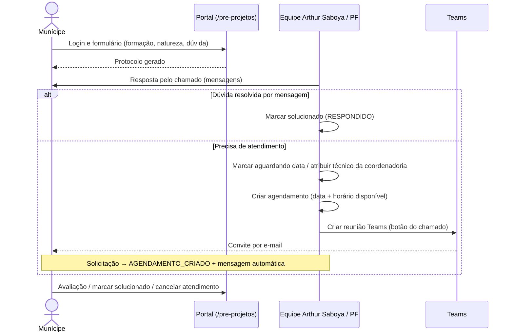

# Sala Arthur Saboya — pré-projetos

Atendimento de orientação técnica sobre pré-projetos (consultas prévias), aberto pelo munícipe como um **chamado** com troca de mensagens e que pode virar um atendimento online.

> **Situação da implementação**: a maior parte das operações deste fluxo ainda é atendida pelo backend NestJS legado, que será descontinuado. O inventário está em [12-migracao-nestjs.md](../12-migracao-nestjs.md). O que está descrito abaixo como ✅ foi confirmado no código deste repositório; o comportamento interno das rotas do NestJS ❓ não pôde ser verificado aqui.

## Modelo de dados ✅

- `SolicitacaoPreProjetoArthurSaboya`: protocolo único (prefixos `PP-` ou `AS-`, ver [atualizar.ts](../../../services/agendamentos/server-functions/atualizar.ts)), nome, e-mail, formação, natureza da dúvida, dúvida, status, avaliação (nota, comentário, data), data do agendamento, coordenadoria, divisão, conta do munícipe, técnico Arthur Saboya e vínculo 1:1 com `Agendamento`.
- `SolicitacaoPreProjetoArthurSaboyaMensagem`: mensagens do chamado; autor `MUNICIPE`, `PONTO_FOCAL` ou `SISTEMA`.
- Tipo de agendamento fixo: **"Pré-projetos (Arthur Saboya)"** (`TIPO_AGENDAMENTO_ARTHUR_SABOYA`).

## Status da solicitação ✅

| Status | Rótulo / significado | Ação de encerramento |
|---|---|---|
| `SOLICITADO` | Aberta | "Marcar solucionado" |
| `RESPONDIDO` | Solucionado | — |
| `AGUARDANDO_DATA` | Aguardando definição de data | "Encerrar chamado" |
| `AGENDAMENTO_CRIADO` | Atendimento agendado | "Concluir atendimento" |

Fonte: [lib/arthur-saboya-perfis.ts](../../../lib/arthur-saboya-perfis.ts). Podem encerrar: ARTHUR_SABOYA, ADM_ARTHUR_SABOYA e DEV.

## Perfis ✅

- `ARTHUR_SABOYA` (técnico) e `ADM_ARTHUR_SABOYA` (administrador local).
- Ao receber um desses perfis, o usuário é lotado automaticamente na **divisão Arthur Saboya**:
  - `DIVISAO_ID_PRE_PROJETOS`;
  - ou, se não houver, uma divisão ativa da CAP com sigla `ARTHUR_SABOYA` ou `ATHURSABOYA`, ou com nome contendo "Arthur Saboya" ([lib/usuarios-core.ts](../../../lib/usuarios-core.ts)).
- Técnicos `TEC` lotados nessa divisão também veem os agendamentos da divisão.

## Fluxo

## Regras confirmadas neste repositório ✅

- Os agendamentos desse tipo **não aparecem** na lista geral nem no dashboard, e **não podem ser criados** pela tela de criação interna ([criar.ts](../../../services/agendamentos/server-functions/criar.ts)).
- Duração do atendimento: **30 min** (`PRE_PROJETO_DURACAO_ATENDIMENTO_MINUTOS`).
- A reunião Teams **não é criada automaticamente** quando se atribui um técnico; o ponto focal a dispara pelo botão do chamado ([atualizar.ts](../../../services/agendamentos/server-functions/atualizar.ts)).
- Ao passar o agendamento para `AGENDADO`, ou ao criar a reunião, a solicitação vai para `AGENDAMENTO_CRIADO` e recebe a mensagem do sistema: "O atendimento técnico foi agendado para o dia {data} às {hora}. O atendimento será realizado de forma online, por meio do link enviado para o seu e-mail. Caso não possa comparecer, solicitamos que cancele o agendamento pelo botão Cancelar Atendimento."
- O prazo de resposta informado ao munícipe é de **até 5 dias úteis** (texto da tela [pre-projetos/page.tsx](../../../app/_portal/pre-projetos/page.tsx)). ❓ O sistema não controla esse prazo.

## Operações que dependem do NestJS ❓

| Público | Operação | Rota no backend |
|---|---|---|
| Munícipe | Enviar pedido | `POST agendamentos/publico/pre-projetos` |
| Munícipe | Listar / detalhar chamados | `agendamentos/municipes/pre-projetos-chamados[/{id}]` |
| Munícipe | Mensagem, marcar solucionado, avaliar, cancelar atendimento | `.../{id}/mensagens`, `/marcar-solucionado`, `/avaliacao`, `/cancelar-atendimento` |
| Equipe | Listar pedidos | `agendamentos/solicitacoes-pre-projetos/arthur-saboya/portal/buscar-tudo` |
| Equipe | Detalhe, mensagens | `.../portal/{protocolo}`, `.../mensagens` |
| Equipe | Confirmar resposta, aguardando data, criar agendamento, atribuir técnico | `.../confirmar-resposta-enviada`, `/marcar-aguardando-data`, `/criar-agendamento`, `/atribuir-tecnico-coordenadoria` |
| Ambos | Chat em tempo real | Socket.IO: `preprojeto:join` / `preprojeto:atualizado` |
