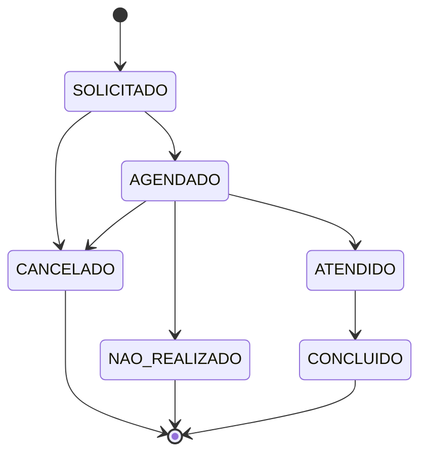

# Ciclo de vida do agendamento

## Máquina de estados ✅

Fonte: [lib/agendamento-transicoes.ts](../../../lib/agendamento-transicoes.ts) (coberta por [tests/agendamento-transicoes.test.ts](../../../tests/agendamento-transicoes.test.ts)).

| Status | Significado |
|---|---|
| `SOLICITADO` | Pedido registrado, aguardando técnico, horário ou confirmação |
| `AGENDADO` | Confirmado (manualmente ou ao criar a reunião Teams) |
| `ATENDIDO` | Atendimento realizado |
| `CONCLUIDO` | Encerrado após o atendimento |
| `NAO_REALIZADO` | Não ocorreu; pode ter um motivo de não atendimento |
| `CANCELADO` | Cancelado pela administração, coordenadoria, munícipe ou CAP |

`CONCLUIDO`, `NAO_REALIZADO` e `CANCELADO` são **terminais**: nenhum campo pode ser alterado depois ("Agendamento finalizado não pode ser alterado").

## Criação

| Origem | Status inicial | Regra | Fonte |
|---|---|---|---|
| Tela interna (ADM/DEV) | `AGENDADO` se houver processo; senão `SOLICITADO` | Duração padrão de 60 min; bloqueia duplicata processo + data/hora; recusa o tipo "Pré-projetos (Arthur Saboya)" | [criar.ts](../../../services/agendamentos/server-functions/criar.ts) |
| Portal (munícipe) | `SOLICITADO` | Ver [portal-processos-e-bi.md](portal-processos-e-bi.md) | [lib/portal-processos-core.ts](../../../lib/portal-processos-core.ts) |
| Planilha SMUL / Outlook | `SOLICITADO` | Ver [importacao-planilhas.md](importacao-planilhas.md) | [lib/agendamentos-import.ts](../../../lib/agendamentos-import.ts) |

O nome do munícipe é padronizado (iniciais maiúsculas, preposições em minúsculas — `padronizarNome`). Nas listagens o CPF aparece mascarado (`000.***.***-00`).

## Atualização ✅

Fonte: [services/agendamentos/server-functions/atualizar.ts](../../../services/agendamentos/server-functions/atualizar.ts).

### Validações

- A transição de status precisa ser permitida pela máquina de estados.
- `CANCELADO` exige `motivoCancelamento` com no mínimo 5 caracteres; grava `canceladoEm` e `canceladoPorId`.
- Confirmar (`AGENDADO`) um atendimento **presencial** exige `localAtendimento` preenchido.
- Ao marcar `ATENDIDO` ou `AGENDADO`, o motivo de não atendimento é apagado.
- **TEC**: só altera agendamentos em que é o técnico, e só `status` (ATENDIDO, NAO_REALIZADO ou CONCLUIDO) e `motivoNaoAtendimentoId`.
- **PF/COORD**: só agendamentos da própria coordenadoria; não podem mudar a coordenadoria; só atribuem técnicos da própria coordenadoria.
- Técnico atribuível: perfil `TEC`, ou `DEV` com divisão (`usuarioPodeSerTecnicoAtribuido`).
- A atribuição por RF busca ou cria o técnico (ver [importacao-planilhas.md](importacao-planilhas.md#técnico-pelo-rf)).

### Agenda e concorrência

- Trocar técnico, data/hora ou confirmar (`AGENDADO`) um agendamento que tem modalidade exige um **slot livre** na agenda do técnico de destino ([agenda-tecnicos-ausencias-reserva.md](agenda-tecnicos-ausencias-reserva.md)). Cancelar ou marcar como não realizado não exige.
- A transação bloqueia os técnicos envolvidos e o próprio agendamento (`FOR UPDATE`) e confere se técnico, horário e status ainda são os lidos antes. Se mudaram: "O agendamento foi alterado por outra pessoa. Atualize a página." (HTTP 409).
- Remarcação sem `dataFim` usa 60 min, ou 30 min no tipo Arthur Saboya.

### Efeitos colaterais

| Situação | Efeito |
|---|---|
| Troca de técnico ou horário | Evento `REATRIBUIDO_OU_REMARCADO`, ou `ATRIBUIDO_RESERVA` se o agendamento estava encaminhado à reserva sem técnico |
| Mudança de status | Evento `STATUS_ALTERADO` |
| Agendamento com reunião Teams e mudança de técnico, horário, e-mail, munícipe, coordenadoria ou cancelamento | Marca a fila de sincronização do Teams e tenta sincronizar na hora ([teams-e-presenca.md](teams-e-presenca.md)) |
| Primeiro técnico atribuído a um `SOLICITADO` sem reunião, não presencial e fora do fluxo Arthur Saboya | Cria a reunião Teams automaticamente, o que muda o status para `AGENDADO` |
| Tipo Arthur Saboya passando de `SOLICITADO` para `AGENDADO` | Solicitação vai para `AGENDAMENTO_CRIADO` e o munícipe recebe uma mensagem automática no chamado |

## Cancelamento

| Quem | Como | Regra |
|---|---|---|
| ADM/DEV | Ação "excluir" ([excluir.ts](../../../services/agendamentos/server-functions/excluir.ts)) | Não apaga o registro: muda para `CANCELADO` com o motivo "Cancelado pela administração." e cancela a reunião Teams, se houver |
| PF/COORD/ADM/DEV | "Cancelar reunião" ([cancelar-reuniao-teams.ts](../../../services/agendamentos/server-functions/cancelar-reuniao-teams.ts)) | Motivo com no mínimo 5 caracteres; cancela o agendamento e o evento no Teams |
| Edição (status `CANCELADO`) | [atualizar.ts](../../../services/agendamentos/server-functions/atualizar.ts) | Motivo com no mínimo 5 caracteres |
| Munícipe | Portal ([portal-processos.ts](../../../services/agendamentos/server-functions/portal-processos.ts)) | Se já estiver `AGENDADO`, só com **24 h ou mais** de antecedência |
| CAP | Recusa na conferência | Ver [conferencia-cap.md](conferencia-cap.md) |

## Listagem ✅

[buscar-tudo.ts](../../../services/agendamentos/query-functions/buscar-tudo.ts):

- Filtros: busca livre (munícipe, processo, CPF), status, período, coordenadoria, técnico e tipo de processo.
  - **Digital**: número no padrão `0000.0000/0000000-0`.
  - **Físico**: qualquer outro número, ou sem processo.
- Ficam fora da lista os agendamentos do tipo Arthur Saboya (tratados em tela própria) e os que aguardam conferência da CAP.
- A página inicial mostra, por padrão, só **o dia de hoje** ([app/(rotas-auth)/page.tsx](../../../app/(rotas-auth)/page.tsx)).
- O escopo por perfil está em [07-autenticacao-e-autorizacao.md](../07-autenticacao-e-autorizacao.md#perfis).

## Dashboard ✅

[dashboard.ts](../../../services/agendamentos/query-functions/dashboard.ts):

- Indicadores por ano, mês, semana ou dia.
- Percentual de realizados, média diária e motivos de não realização.
- Filtros por coordenadoria e divisão.
- Aplica as mesmas exclusões e escopos da listagem.
