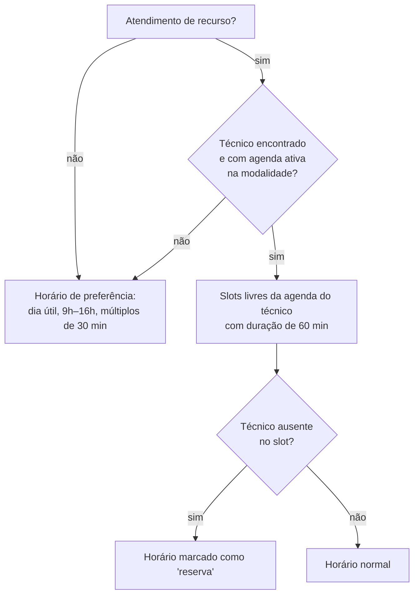

# Portal: agendamento por processo e consulta ao BI

Fontes: [lib/portal-processos-core.ts](../../../lib/portal-processos-core.ts), [lib/portal-processos-constantes.ts](../../../lib/portal-processos-constantes.ts), [lib/bi-processos.ts](../../../lib/bi-processos.ts), [lib/bi-elegibilidade.ts](../../../lib/bi-elegibilidade.ts), [services/agendamentos/server-functions/portal-processos.ts](../../../services/agendamentos/server-functions/portal-processos.ts), tela [form-agendamento-processo.tsx](../../../app/_portal/processos/_components/form-agendamento-processo.tsx).

Requisitos de origem: RF-001 a RF-018 e RN-001 a RN-008 em `REQUISITOS_PORTAL_AGENDAMENTOS.md` ([histórico](../historico/README.md)).

## Pré-condição

O munícipe precisa estar logado no portal. Toda Server Action do portal recebe o token e o valida com `requireMunicipeFromToken`.

## Tipos de agendamento do portal

Lista fechada em `TIPOS_AGENDAMENTO_PORTAL_PROCESSO`. Os tipos são criados em `tipos_agendamento` se não existirem.

1. **Atendimento técnico sobre comunique-se ou indeferimento** — chamado de "atendimento de recurso" no código.
2. Entrega de documentos para atendimento de comunique-se ou interposição de recurso de processos físicos.
3. Retirada de alvará/guia complementar/guias de outorga.
4. Vista de processo físico.

Relação com o projeto: Autor do projeto, Autorizado, Proprietário, Responsável técnico, Terceiros.

## Consulta ao BI

1. O número informado é normalizado (trim e espaços simples) e buscado em `dbo.prata_comuniquese` e `dbo.prata_despacho`, pelo campo `processo` **ou** `protocolo`.
2. Cada linha vira uma **ocorrência**: tipo, processo, protocolo, sistema, situação, unidade, responsável e RF do responsável. O ID é um hash SHA-256, e ocorrências repetidas são descartadas.
3. Elegibilidade:
   - **Comunique-se**: sempre elegível. **Pendente de confirmação**: Regra marcada como "provisória" no código ([bi-elegibilidade.ts](../../../lib/bi-elegibilidade.ts)).
   - **Despacho**: elegível só se a situação for "indeferido" (sem diferenciar maiúsculas e minúsculas).
4. Se o BI estiver indisponível, o portal mostra "Não foi possível consultar o BI. Tente novamente mais tarde." e não cria o agendamento.

## Roteamento pela unidade do BI

`mapearUnidadeBi` gera variações da unidade, por exemplo removendo `SMUL/`, trocando `-` por `/`, tirando espaços e usando o primeiro segmento. A ordem de busca é:

1. **sigla de divisão** ativa → divisão + coordenadoria;
2. senão, **sigla de coordenadoria** ativa → só a coordenadoria;
3. senão, a unidade não é mapeada.

## Técnico responsável

O RF do responsável no BI vira o login `d` + 6 primeiros dígitos (`rfParaLogin`). O técnico só é usado se existir, estiver ativo e for `TEC` (ou `DEV` com divisão).

## Escolha do horário

- A preferência depende de confirmação pela coordenadoria (aviso na tela).
- No modo agenda, os slots que caem em ausência do técnico são oferecidos assim mesmo, marcados como reserva (`horariosReserva`).
- Data e horário precisam ser futuros (fuso de São Paulo) e cair em dia útil.

## Criação da solicitação

Validações:

| Campo | Regra |
|---|---|
| CPF | Válido (`validaCPF_CNPJ`) |
| Telefone | 10 dígitos ou mais |
| Processo | Obrigatório |
| Tipo / relação | Valores das listas |
| Atendimento de recurso | Modalidade (Presencial/Online) obrigatória; dúvida com 10 a 5000 caracteres; ocorrência elegível obrigatória se o processo foi achado no BI |
| Duplicidade | O mesmo munícipe não pode ter o mesmo processo no mesmo horário (exceto cancelados e não realizados) |

O nome e o e-mail vêm do cadastro do munícipe. O BI é **consultado de novo** no envio. Se a ocorrência escolhida mudou: "A ocorrência selecionada mudou no BI. Pesquise novamente."

### Processo não localizado

Se o processo não é achado (atendimento de recurso) ou não é elegível (outros tipos), a primeira chamada responde `precisaConfirmacao`. O munícipe precisa confirmar que quer seguir assim ("Confira o número do processo" / "Corrigir número").

### Resultado gravado

| Situação | Coordenadoria / divisão | Técnico | `conferenciaCapStatus` |
|---|---|---|---|
| Não localizado (confirmado) ou unidade não mapeada | vazias | vazio | `AGUARDANDO` → vai para a [Conferência CAP](conferencia-cap.md) |
| Mapeado, técnico com agenda, presente | da unidade | técnico do BI | — |
| Mapeado, técnico com agenda, **ausente** no horário | da unidade | vazio, com `encaminhadoReservaEm` e motivo "Ausência do responsável original: {tipo}" | — |
| Mapeado, sem agenda | da unidade | vazio (a coordenadoria atribui) | — |

Sempre com `status = SOLICITADO`, `origemPortalProcesso = true`, duração de 60 min e o **snapshot do BI** (tipo do recurso, protocolo, sistema, situação, unidade, responsável e RF originais, `snapshotBiEm`). Também grava os eventos `CRIADO` e, se for o caso, `ENCAMINHADO_RESERVA`.

No modo agenda, a criação bloqueia o técnico (`FOR UPDATE`) e confere de novo se o slot está livre (proteção contra dupla reserva — RN-008).

## Consulta e cancelamento pelo munícipe

- `listarAgendamentosPortalProcesso` traz só os agendamentos do próprio munícipe com origem no portal: data, processo, status, CAP, modalidade, local, sala, orientações, observação da CAP e link do Teams.
- O status mostrado ao munícipe é traduzido por `rotuloStatusAgendamentoPortal`. Exemplos: "Em conferência pela CAP", "Aguardando confirmação da coordenadoria", "Processo não localizado".
- Cancelamento:
  - permitido nas transições válidas para `CANCELADO`;
  - se já estiver `AGENDADO`, só com **24 h ou mais** de antecedência;
  - cancela também a reunião Teams;
  - grava o evento `CANCELADO` com `origem: PORTAL`.
